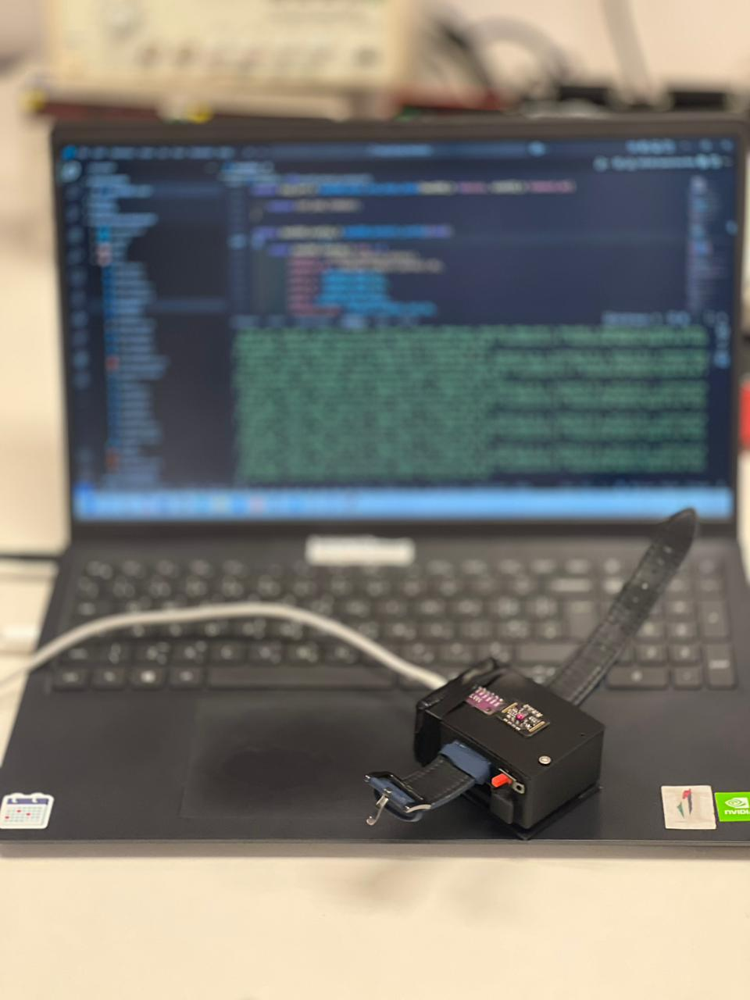
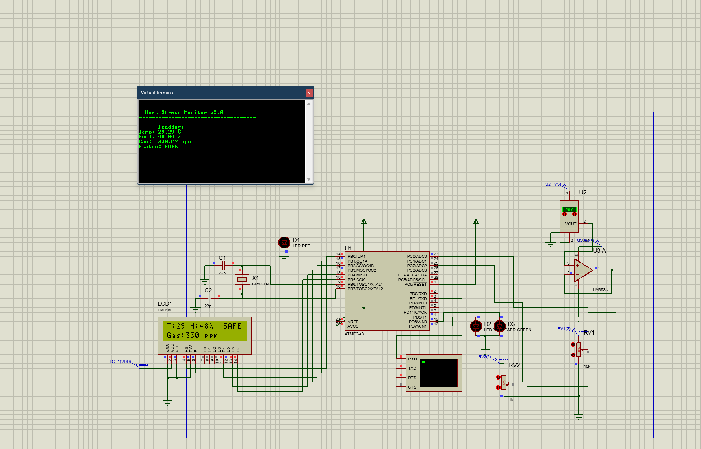

# Heat Stroke Predictor - Wearable System

A real-time heat stress monitoring system built on the **ATmega8 microcontroller**. The wearable device continuously monitors environmental conditions to predict and prevent heat stroke.



## Features

- **Temperature Monitoring** - Real-time temperature sensing (LM35 / analog sensor via op-amp conditioning)
- **Humidity Monitoring** - Tracks relative humidity percentage
- **Gas Detection** - Monitors air quality in PPM
- **Status Alert System** - Classifies conditions as SAFE, WARNING, or DANGER
- **LCD Display** - 16x2 LM016L LCD showing live readings (Temperature, Humidity, Gas level, Status)
- **Serial Output** - Virtual terminal output for data logging via UART
- **LED Indicators** - Green (SAFE), Red (WARNING/DANGER) visual alerts
- **Signal Conditioning** - LM358N op-amp circuit for accurate analog sensor readings

## Circuit Simulation (Proteus)



### Components

| Component | Description |
|-----------|-------------|
| U1 - ATmega8 | Main microcontroller |
| LCD1 - LM016L | 16x2 character LCD display |
| U2 | Temperature/Humidity sensor |
| U3 - LM358N | Op-amp for signal conditioning |
| D1 | Red LED (alert indicator) |
| D2 | Red LED (warning indicator) |
| D3 | Green LED (safe indicator) |
| X1 | Crystal oscillator with 22pF capacitors |
| RV1, RV2 | Potentiometers for calibration |

## Sample Output

```
======================================
    Heat Stress Monitor v2.0
======================================

------ Readings ------
Temp: 29.29 C
Hum:  48.04 %
Gas:  330.07 ppm
Status: SAFE
```

## Tools Used

- **Proteus 8** - Circuit simulation and design
- **AVR-GCC / Arduino** - Firmware development
- **ATmega8** - Target microcontroller

## How It Works

1. Sensors read temperature, humidity, and gas concentration
2. Analog signals are conditioned through the LM358N op-amp
3. ATmega8 processes the ADC readings and computes risk level
4. Results are displayed on the LCD and sent via UART to the virtual terminal
5. LEDs indicate the current status visually
